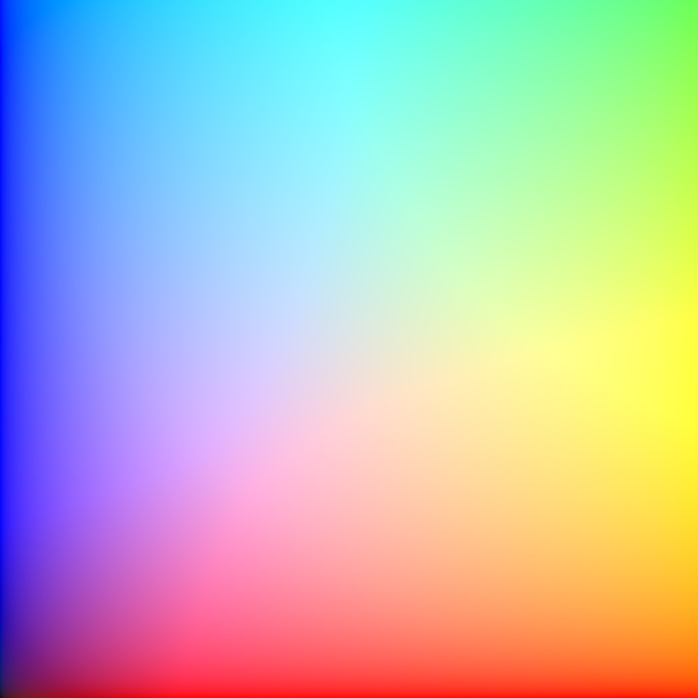

# JXRMaker

JXRMaker is a simple command-line utility for creating HDR JPEG XR (JXR) images on Windows.

## Sample



## Usage

To use JXRMaker, open a command prompt and navigate to the directory containing `JXRMaker.exe`. Then, run the following command:

```shell
JXRMaker.exe <width> <height> <output file path>
```

Replace `<width>` and `<height>` with the desired dimensions of the image, and `<output file path>` with the path where you want the output JXR file to be saved.

For example, to create a 1920x1080 image and save it as `output.jxr`, you would run:

## Viewing the Output

The output files are saved in the HDR JPEG XR (.jxr) format, which is not supported by all image viewers. However, you can use the [HDR WCG Image Viewer](https://apps.microsoft.com/store/detail/hdr-wcg-image-viewer/9PGN3NWPBWL9?hl=en-us&gl=us) available in the Microsoft Store or [Github](https://github.com/13thsymphony/HDRImageViewer) to view these images.

## Building from Source

This project is written in C++ and uses the Windows Imaging Component (WIC) API to create the images. To build the project from source, you will need a Windows system with the Windows SDK and a C++ compiler installed.

1. Clone the repository to your local system.
2. Open the project in Visual Studio (I use VS 2022)
3. Build the project to produce `JXRMaker.exe`.

## License

This project is licensed under the MIT license. See the [LICENSE](LICENSE.txt) file for details.

## Contributions

Contributions are welcome! Please open an issue if you encounter a bug or have a feature request. Pull requests are also welcome.
